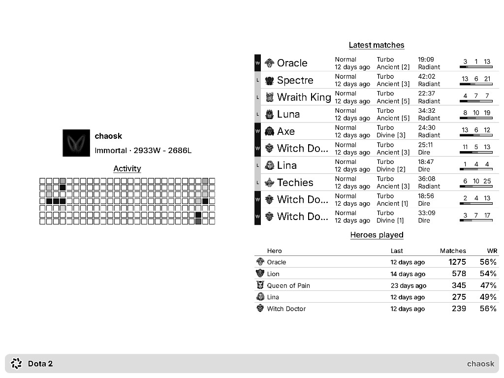

# TRMNL Dota 2 Stats

A [TRMNL](https://trmnl.com/) private plugin that shows Dota 2 player stats on your e-ink display, powered by the [OpenDota API](https://www.opendota.com/).

<picture>
  <source media="(prefers-color-scheme: dark)" srcset="docs/full-layout-dark.png">
  <source media="(prefers-color-scheme: light)" srcset="docs/full-layout.png">
  
</picture>

*Full layout — player header, activity heatmap, latest matches, and top heroes.*

## Disclaimer

**This is AI slop,** that was hastily cobbled together so that I can see how TRMNL plugins work.

## What it shows

- **Activity heatmap** — when you played over the last ~26 weeks (or last 120 matches)
- **Latest matches** — recent matches with hero icon, side (R/D), W/L, and a compact K/D/A bar
- **Heroes played** — most-played heroes with icon, match count, and win rate
- **Player header** — name, rank medal, W/L record

All four TRMNL layouts are supported: full, half horizontal, half vertical, and quadrant.

## Setup

1. Find your **OpenDota account ID** (not Steam ID64): open [opendota.com](https://www.opendota.com/), go to your profile, and copy the number from the URL (`/players/12345678` → `12345678`).
2. Create a **Private Plugin** on TRMNL (or use `trmnlp` below).
3. Paste or `trmnlp push` — you need **every** piece below:

   | TRMNL editor tab | Copy from |
   |------------------|-----------|
   | Shared | `src/shared.liquid` |
   | Serverless (Python) | `src/transform.py` |
   | Full / Half H / Half V / Quadrant | matching `src/*.liquid` |
   | Settings | polling URL + Account ID from `src/settings.yml` |

4. Set **Account ID** in the plugin form and save.

If the screen is blank, the usual cause is **Serverless not enabled** or `transform.py` not pasted. The markup alone is not enough.

## Local preview

Requires [Docker](https://www.docker.com/) or Ruby 3.4+ with `gem install trmnl_preview`.

```sh
docker compose up
# open http://localhost:4567/full
```

Or:

```sh
chmod +x bin/trmnlp
./bin/trmnlp serve
```

Default preview account ID is Dendi (`70388657`) in `.trmnlp.yml`. Change `custom_fields.account_id` to preview another player.

## Deploy to your TRMNL device

```sh
gem install trmnl_preview   # requires Ruby 4+; or use Docker via bin/trmnlp
./bin/trmnlp login          # API key saved to ~/.config/trmnlp (bind-mounted in Docker)
./bin/trmnlp push
```

After the first push, add the plugin `id` from TRMNL to `src/settings.yml` so future pushes update the same plugin.

## OpenDota

Rate limits apply without an [OpenDota API key](https://www.opendota.com/api-keys); add one later via polling headers if needed.

## License

[MIT](LICENSE)
